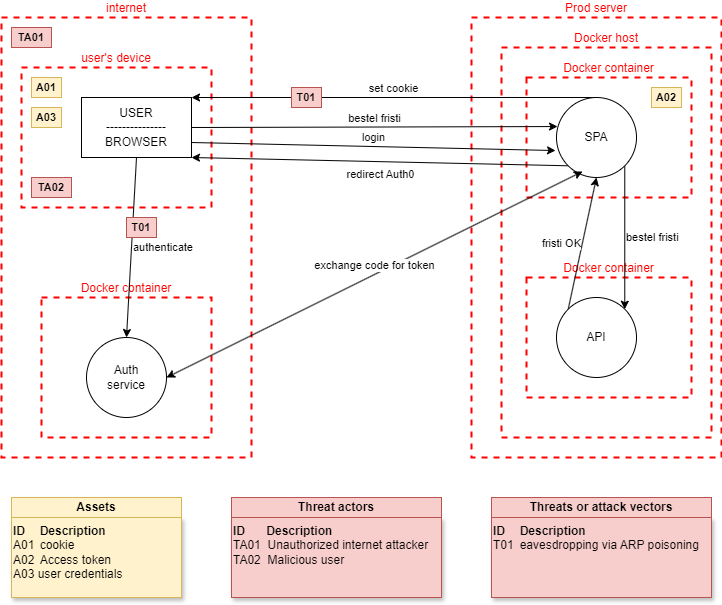
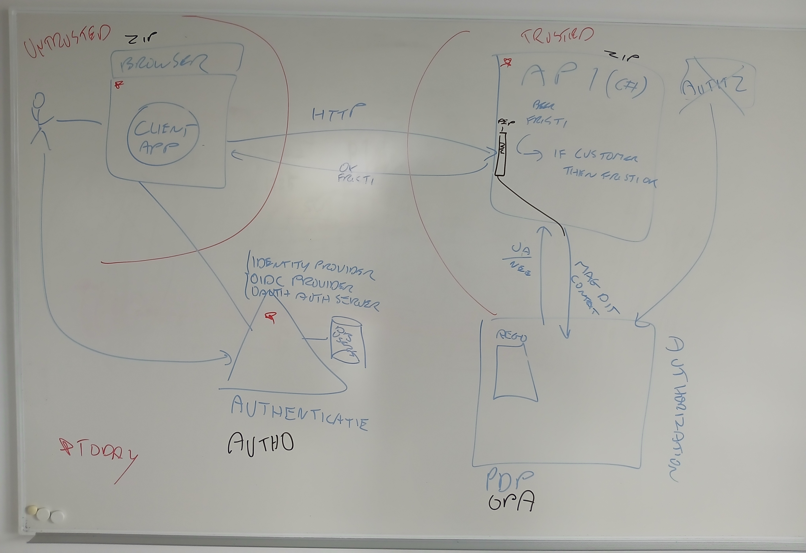
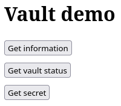
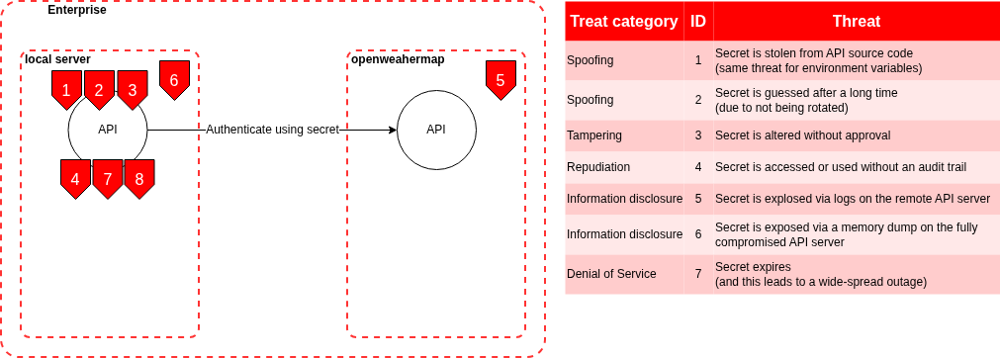
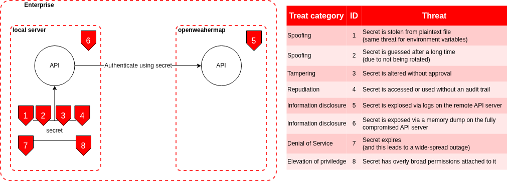
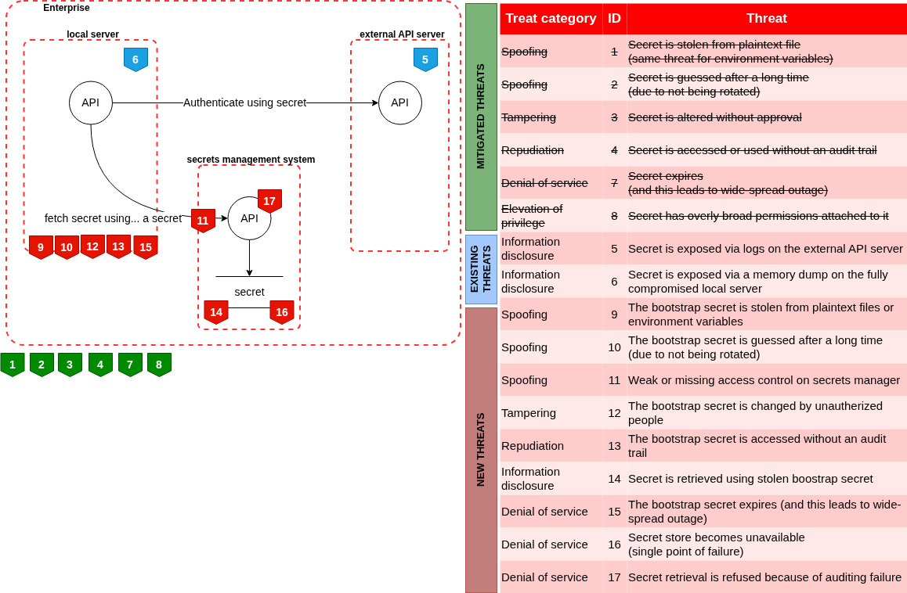

Repository voor OLOD Cyber Security Advanced
Electronica/ICT - IT & Cybersecurity en Cloud 2025 - 2026
Patrick Lanove

Hier worden de opdrachten toegelicht die we voor dit vak moeten maken
* [opdracht 1](#opdracht-1)
* [opdracht 3](#opdracht-3)
* [opdracht 5](#opdracht-5)

# Opdracht 1
## Threat model


*dit model is nog in opbouw en is nog geen volledige weergave*

## Overzicht schema


## Gebruikte software
* startcode bij opdracht (websec-OPA-jumpstart)
* dotnet 8.0.414 sdk
* OpenPolicyAgent.Opa.AspNetCore (dotnet package)
* docker

## Gebruik
**instellingen voor de SPA**
SPA/settings.js
```javascript
import { Log, UserManager} from "oidc-client-ts";

Log.setLogger(console);
Log.setLevel(Log.INFO);

const url = window.location.origin + "";

export const settings = {
    authority: "<your authority>", // https://opa-poc-patrick.eu.auth0.com
    client_id: "<your clientid>", // vLW5tLBAnQ7X261jYY5oGUfsGhUZiyYr
    redirect_uri: url + "/callback.html",
    post_logout_redirect_uri: url + "/index.html",
    response_type: "code",
    scope: "openid email roles",

    response_mode: "query",

    filterProtocolClaims: true,
    extraQueryParams: {
        audience: "<your audience>", // bar-auth0-api
    },
    api_bar_uri: "http://localhost:5172/api/bar",
    api_manageBar_uri: "http://localhost:5172/api/managebar"
};

export {
    Log,
    UserManager
};
```

**instellingen voor de API**
API/appsettings.json
```json
{
  "Logging": {
    "LogLevel": {
      "Default": "Information",
      "Microsoft.AspNetCore": "Warning"
    }
  },
  "AllowedHosts": "*",
  "Jwt": {
    "Authority": "<your authority>", // https://opa-poc-patrick.eu.auth0.com
    "Audience": "<your audience>" // bar-auth0-api
  },
  "Cors": {
    "Origin": "http://localhost:3000"
  }
}
```

**Build and deploy van de services**
```
docker-compose -f docker-compose.yml build
docker-compose -f docker-compose.yml up
```

De SPA zal bereikbaar zijn via localhost:3000


# Opdracht 3
Analyse van CVE-2025-47812, een RCE kwetsbaarheid in WingFTP 7.4.3 en eerdere versies

De kwetsbaarheid bevindt zich hoofdzakelijk in de bestanden loginok.html en SessionModule.lua.
Het artikel van RCEsecurity beschrijft de kwetsbaarheid heel duidelijk

## Bronnen
- [National Vulnerability Database | CVE-2025-47812](https://nvd.nist.gov/vuln/detail/CVE-2025-47812)
- [RCE security | What the NULL?! Pre-Auth Wing FTP Server RCE (CVE-2025-47812)](https://www.rcesecurity.com/2025/06/what-the-null-wing-ftp-server-rce-cve-2025-47812/)


# Opdracht 5


**gebruikte software**
* node.js
* express.js
* Hashicorp vault

## Thread model
**Situatie 1: webserver + externe API**<br/>
De api key (*secret*) wordt bijgehouden als omgevingsvariabele.<br/>
<br/>

**Situatie 2: webserver + externe API**<br/>
De api key (*secret*) wordt bijgehouden in een extern bestand.<br/>


**Situatie 3: webserver + vault + externe API**<br/>
De api key (*secret*) wordt bijgehouden in een extern secrets management system (*hashicorp vault*).<br/>
De vault root token (*bootstrap secret*) wordt bijgehouden als omgevingsvariabele.<br/>



## Gebruik
* node.js omgeving installeren (`npm install`)
* vault opstarten (`vault server -dev -dev-root-token-id root`)
* omgevings variabelen instellen voor communicatie met vault
```bash
export VAULT_ADDR=http://127.0.0.1:8200
export VAULT_ROOT_TOKEN=root
```
* nieuwe secrets engine aanmaken (`vault secrets enable --version=1 kv`)
* API key oplaan in vault (`vault kv put kv/openweathermap secret=`)
* webserver starten (`node server.js`)